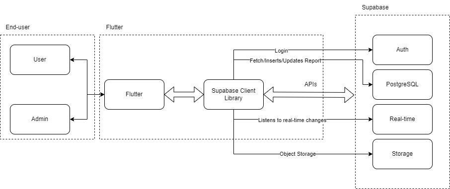
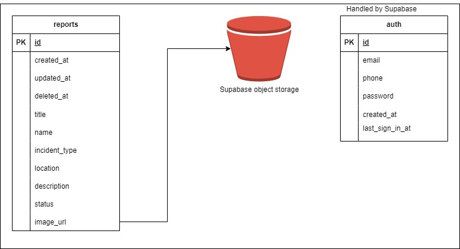
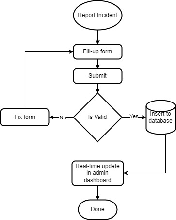
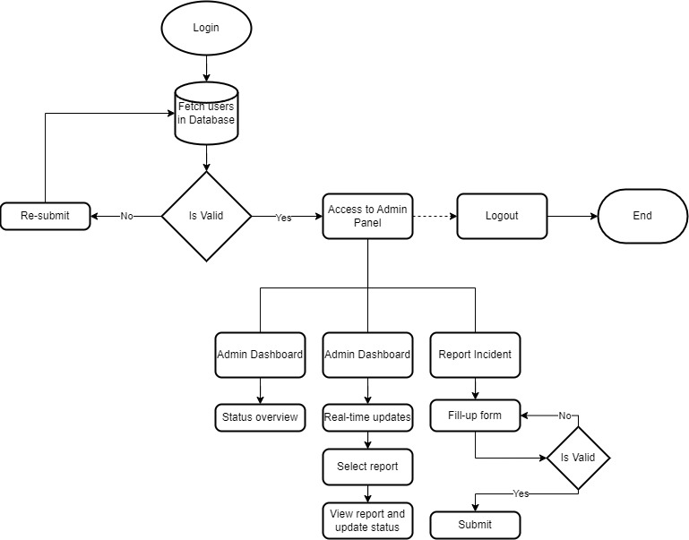
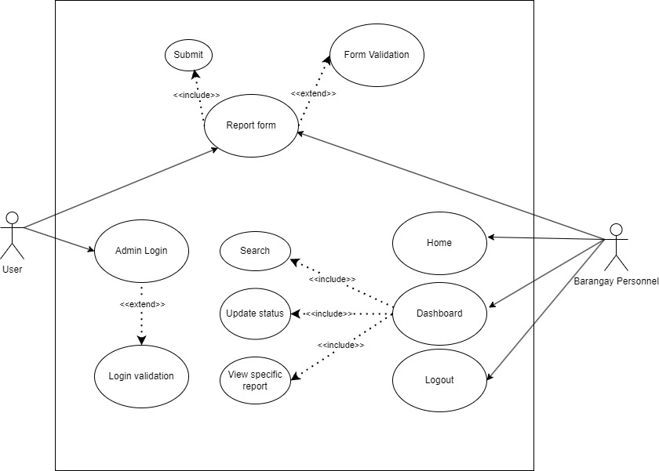

# Running in your local machine
## Requirements
- Flutter installed on your machine. See: https://docs.flutter.dev/get-started/install
- Visual Studio Code
- Install Flutter plug-in in VSCode. Marketplace -> Search 'Flutter' -> Install
- Create .env in root directory
- (Optional) scrcpy, see: https://github.com/Genymobile/scrcpy

## Environment
Create .env
```
SUPABASE_URL=SOME_VALUE
SUPABASE_ANONKEY=SOME_VALUE
```

The value of this is in your Supabase account

## Running the application
1. In your terminal, go to root directory and run ``` flutter pub get ```
2. In VS Code, top-left click 'Run' and click Run without debugging. Make sure to open first your main.dart

## Building APK/iOS
1. For APK ``` flutter build apk --release ```. APK file will located in build/app/outputs/flutter-apk/app-release.apk.
2. FOr building iOS, we need xcode and mac device


# Modules
## Report Form
This is the main feature of this application where users and admin can report incidents instantly without any necessary steps.

- **Title**: Required (Only accepts alphabet a-z, A-Z)
- **Name**: Optional
- **Incident Type**: Required (Dropdown categories or custom input)
- **Location**: Required
- **Description**: Required (Special characters not allowed)
- **Attach Picture**: Optional (Can take from camera or gallery)

## Login
To create a user, go to supabase and auth then click add user. If you have a login automatically you are set as Admin. 

- **Username**: Required (Sanitized)
- **Password**: Required (Sanitized)

## Admin Home
Your default view when logged in as Admin. There's quick actions, status overview of all incident reports and bottom navigation.

## Admin Dashboard
Only within 48 hours of data is displayed here to prevent data ambiguity.

If the status is equals to resolved, it will not be displayed here.

Dashboard has three components:
1. Search (can index title and status)
2. View specific reports
2. Update status

## Report View
When report is clicked in dashboard, you will be redirected to a View that displays all data of that report. You can update status here.

# Docs
## System Architecture


## Entity Relationship Diagram


## Flowcharts
### User

### Admin


## Use case Diagram

